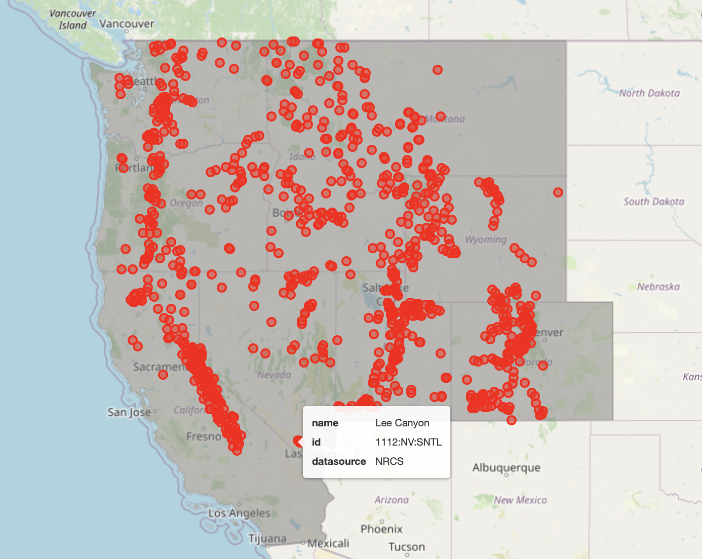
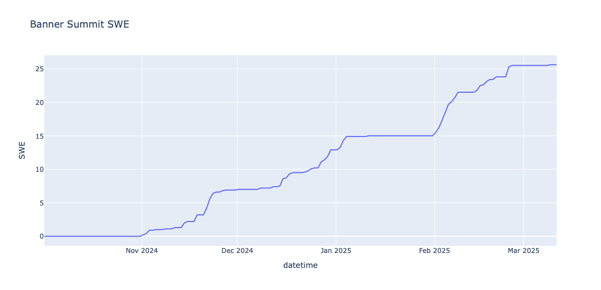

========
metloom
========

.. image:: https://img.shields.io/pypi/v/metloom.svg
        :target: https://pypi.python.org/pypi/metloom
.. image:: https://github.com/M3Works/metloom/actions/workflows/testing.yml/badge.svg
        :target: https://github.com/M3Works/metloom/actions/workflows/testing.yml
        :alt: Testing Status
.. image:: https://readthedocs.org/projects/metloom/badge/?version=latest
        :target: https://metloom.readthedocs.io/en/latest/?version=latest
        :alt: Documentation Status
.. image:: https://img.shields.io/endpoint?url=https://gist.githubusercontent.com/micah-prime/04da387b53bdb4a3aa31253789550a9f/raw/metloom__heads_main.json
        :target: https://github.com/M3Works/metloom
        :alt: Code Coverage

Location Oriented Observed Meteorology

metloom is a python library created with the goal of consistent, simple sampling of
meteorology and snow related point measurments from a variety of datasources is developed by `M3 Works <https://m3works.io>`_ as a tool for validating
computational hydrology model results. Contributions welcome!

Warning - This software is provided as is (see the license), so use at your own risk.
This is an opensource package with the goal of making data wrangling easier. We make
no guarantees about the quality or accuracy of the data and any interpretation of the meaning
of the data is up to you.

* Free software: BSD license

.. code-block:: python

    # Find your data with ease
    # !pip install folium mapclassify matplotlib
    from metloom.pointdata import SnotelPointData, CDECPointData, USGSPointData
    import geopandas as gpd
    import pandas as pd

    # Shapefile for the US states
    shp = gpd.read_file('https://eric.clst.org/assets/wiki/uploads/Stuff/gz_2010_us_040_00_500k.json').to_crs("EPSG:4326")
    # Filter to states of interest
    west_states = ["Washington", "Oregon", "California", "Idaho", "Nevada", "Utah", "Wyoming", "Montana", "Colorado" ]  # , "Arizona", "New Mexico"]
    shp = shp.loc[shp["NAME"].isin(west_states)].dissolve()

    # Collect all points with SWE from CDEC and NRCS
    dfs = []
    for src in  [CDECPointData, SnotelPointData]:
        dfs.append(src.points_from_geometry(shp, [src.ALLOWED_VARIABLES.SWE]).to_dataframe())
    # Combine dataframes
    gdf = pd.concat(dfs)
    # plot the shapefile
    m = shp.explore(
        tooltip=False, color="grey", highlight=False, style_kwds={"opacity": 0.2}, popup=["NAME"]
    )
    # plot the points on top of the shapefile
    gdf.explore(m=m, tooltip=["name", "id", "datasource"], color="red", marker_kwds={"radius":4})

Features
--------
.. code-block:: python

    # !pip install plotly
    from metloom.pointdata import SnotelPointData
    import plotly.express as px
    import pandas as pd

    # Initialize your point
    pt = SnotelPointData("312:ID:SNTL", "Banner Summit")
    swe_variable = pt.ALLOWED_VARIABLES.SWE
    # Get the data
    df = pt.get_daily_data(
        pd.to_datetime("2024-10-01"), pd.to_datetime("2025-03-11"), [swe_variable]
    ).reset_index()
    # Create a time series plot using Plotly Express
    px.line(df, x="datetime", y=swe_variable.name, title=f"{pt.name} SWE")

* Sampling of daily, hourly, and snow course data
* Searching for stations from a datasource within a shapefile
* Current data sources:
    * `CDEC <https://cdec.water.ca.gov/>`_
    * `SNOTEL <https://www.nrcs.usda.gov/wps/portal/wcc/home/dataAccessHelp/webService/webServiceReference/>`_
    * `MESOWEST <https://developers.synopticdata.com/mesonet/>`_
    * `USGS <https://waterservices.usgs.gov/rest/>`_
    * `NWS FORECAST <https://api.weather.gov>`_
    * `GEOSPHERE AUSTRIA <https://data.hub.geosphere.at/dataset/>`_
    * `UCSB CUES <https://snow.ucsb.edu/#>`_
    * `MET NORWAY <https://frost.met.no/index.html>`_
    * `SNOWEX MET STATIONS <https://nsidc.org/data/snex_met/versions/1>`_
    * `CENTER FOR SNOW AND AVALANCHE STUDIES (CSAS) <https://snowstudies.org/csas-facilities/>`_

Requirements
------------
python >= 3.7

Install
-------
.. code-block:: bash

    python3 -m pip install metloom

* Common install issues:
    * Macbook M1 and M2 chips: some python packages run into issues with the new M chips
        * ``error : from lxml import etree in utils.py ((mach-o file, but is an incompatible architecture (have 'x86_64', need 'arm64)``
            The solution is the following

            .. code-block:: bash

                pip uninstall lxml
                pip install --no-binary lxml lxml

Local install for dev
---------------------
The recommendation is to use virtualenv, but other local python
environment isolation tools will work (pipenv, conda)

.. code-block:: bash

    python3 -m pip install --upgrade pip
    python3 -m pip install -r requirements_dev
    python3 -m pip install .

Testing
-------

.. code-block:: bash

    pytest

If contributing to the codebase, code coverage should not decrease
from the contributions. Make sure to check code coverage before
opening a pull request.

.. code-block:: bash

    pytest --cov=metloom

Documentation
-------------
readthedocs coming soon

https://metloom.readthedocs.io.

Usage
-----
See usage documentation https://metloom.readthedocs.io/en/latest/usage.html

**NOTES:**
PointData methods that get point data return a GeoDataFrame indexed
on *both* datetime and station code. To reset the index simply run
``df.reset_index(inplace=True)``

Simple usage examples are provided in this readme and in the docs. See
our `examples <https://github.com/M3Works/metloom/tree/main/docs/gallery>`_
for code walkthroughs and more complicated use cases.

Usage Examples
==============

Use metloom to find data for a station

.. code-block:: python

    from datetime import datetime
    from metloom.pointdata import SnotelPointData

    snotel_point = SnotelPointData("713:CO:SNTL", "MyStation")
    df = snotel_point.get_daily_data(
        datetime(2020, 1, 2), datetime(2020, 1, 20),
        [snotel_point.ALLOWED_VARIABLES.SWE]
    )
    print(df)

Use metloom to find snow courses within a geometry

.. code-block:: python

    from metloom.pointdata import CDECPointData
    from metloom.variables import CdecStationVariables

    import geopandas as gpd

    fp = <path to shape file>
    obj = gpd.read_file(fp)

    vrs = [
        CdecStationVariables.SWE,
        CdecStationVariables.SNOWDEPTH
    ]
    points = CDECPointData.points_from_geometry(obj, vrs, snow_courses=True)
    df = points.to_dataframe()
    print(df)

Tutorials
---------
In the ``Examples`` folder, there are multiple Jupyter notbook based
tutorials. You can edit and run these notebooks by running Jupyter Lab
from the command line

.. code-block:: bash

    pip install jupyterlab
    jupyter lab

This will open a Jupyter Lab session in your default browser.

Credits
-------

This package was created with Cookiecutter_ and the `audreyr/cookiecutter-pypackage`_ project template.

.. _Cookiecutter: https://github.com/audreyr/cookiecutter
.. _`audreyr/cookiecutter-pypackage`: https://github.com/audreyr/cookiecutter-pypackage
